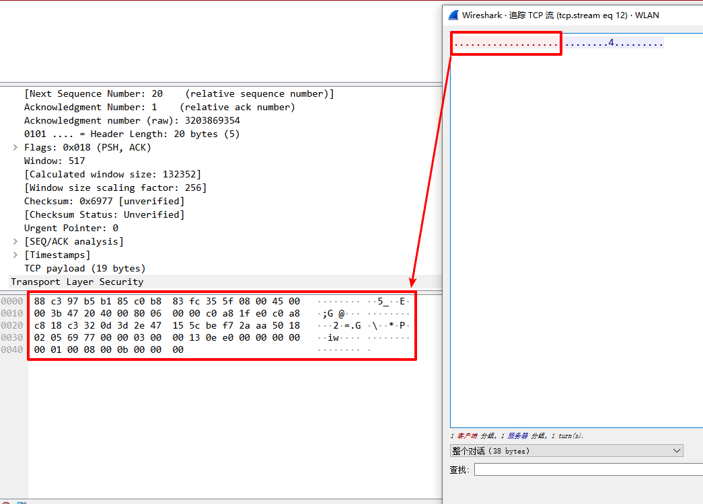
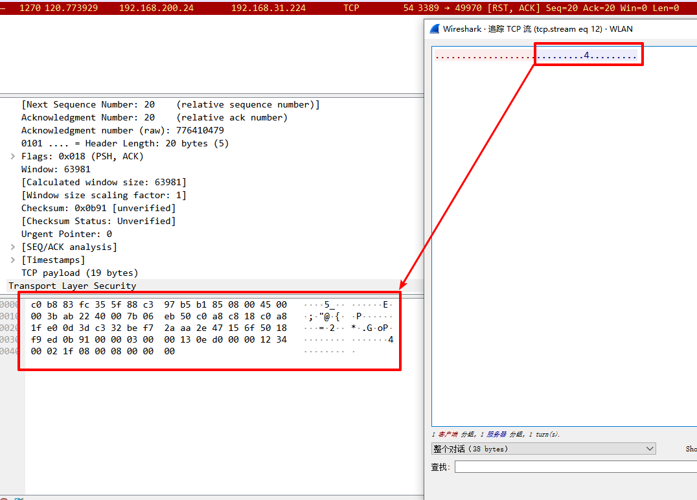
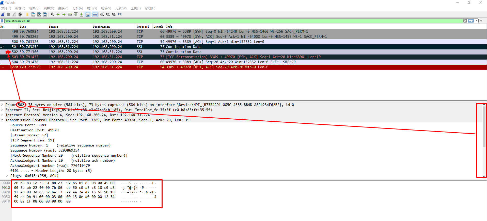
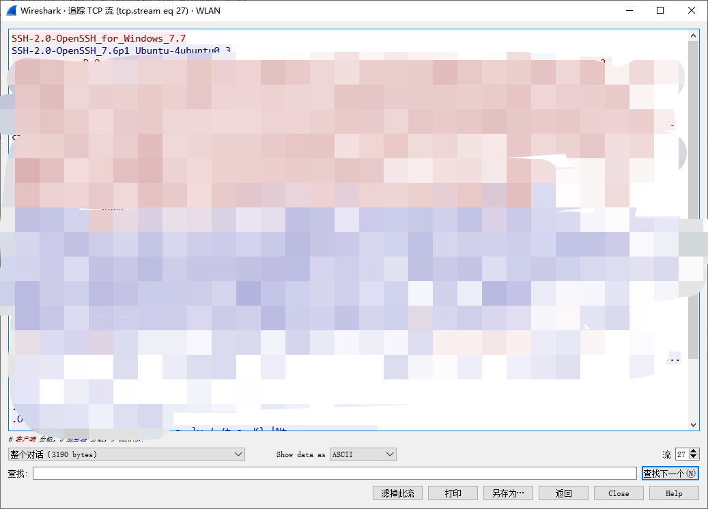

# Go Protocol Detector

本文会介绍 RDP、SSH、FTP 三种协议的抓包分析过程。

> WireShark 使用不操作 10 次。无法回答深入问题。

## 如何使用 WireShark 抓包分析 RDP


简单记录下是如何进行网络协议的抓包分析。本初将举例 RDP（Windows 远程桌面协议） 协议交互封包的抓取。

### 添加过滤

首先打开 WireShark 选择需要查看抓包的网卡，这里是 **WLAN**

添加过滤的规则

```
ip.addr == 192.168.200.24
```

如下图：


### 打开 MSTSC

注意，这台需要远程登录的电脑是 Win 10

注意上图的红色框，这里写你要尝试登录的 Windows 主机 IP。然后点击连接，不需要填写账号密码，避免多余的通信交互。


### 寻抓第一个有 TCP Playload 的包


见上图的红色圈圈和箭头指向的 playload。

### 跟踪 TCP 流


找到第一个 playload 包，跟踪它的 TCP流。

> PS：下载的是中文版，有些关键词确实有点尴尬，对应不出英文···

然后会出现以下的弹窗，选中左侧的红色“点点点”，你会发现这个就是你的第一个 playload 的包



那么后面蓝色的“点点点”，这个就是回复的包了



跟踪到了，那么界面上双击蓝色的“点点点”，其实跳过去了，但是 WireSharp 着色不太好，不明显。那么你得“关闭”这个流跟踪的窗口，然后，中间的窗体滚动上去点，就能看到 Frame 的编号。这样就对应上了。见下图：



### 分析结果

发送的包的内容是

```
03 00 00 13 0e e0 00 00 00 00 00 01 00 08 00 0b 00 00 00 
```

接收到的反馈包是

```
03 00 00 13 0e d0 00 00 12 34 00 02 1f 08 00 08 00 00 00
```

那么其实就需要重复这个过程，把以下几个系统版本的 RDP 给抓包分析出来即可。

* XP
* Vista
* 2000
* 2003
* 2008
* Win 7
* Win 10
* 2012
* 2016
* 2019

## 如何使用 WireShark 抓包分析 SSH

基本的分析参见 RDP 的分析。这里针对 SSH 交互流程进行了特殊处理。

SSH 协议的握手流程中，第二步是 Client 与 Server 的版本协议交换。那么就从这里下手，发送你的 Client 版本信息，那么 Server 就应该回复对应的给你。



Client

```
SSH-2.0-OpenSSH_for_Windows_7.7
53 53 48 2d 32 2e 30 2d 4f 70 65 6e 53 53 48 5f 66 6f 72 5f 57 69 6e 64 6f 77 73 5f 37 2e 37 0d 0a
```

Server

```
SSH-2.0-OpenSSH_7.6p1 Ubuntu-4ubuntu0.3
53 53 48 2d 32 2e 30 2d 4f 70 65 6e 53 53 48 5f 37 2e 36 70 31 20 55 62 75 6e 74 75 2d 34 75 62 75 6e 74 75 30 2e 33 0d 0a
```


## 致谢

本文参考了以下的文章，才做出了复现。

[《从协议提取到多功能RDP识别脚本》](https://cloud.tencent.com/developer/article/1144882)，文章中的一个 [python 版本](https://github.com/lonelyvaf/rdp_find) 的实现

没有找到原文，是转载的。但是给出了作者信息（未核实）：微信公众号 - 晨星先生（MoXuanIT）